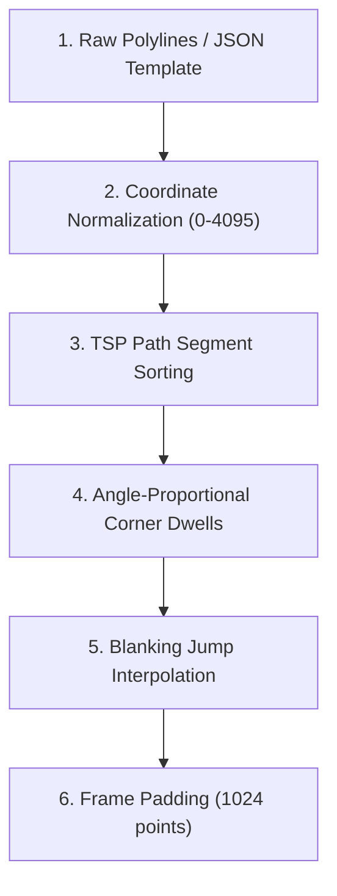

# Laser Galvo Polyline & Path Preparation Skill

This skill documents the complete pipeline for converting 2D vector shapes, polylines, and text paths into optimized DAC point streams for physical ILDA/Helios laser galvo scanners using the `laserlogic` crate.

---

## 1. Physical Galvo Scanner Characteristics & Constraints

Laser galvo mirrors have physical mass and inertia. Driving galvos without proper path optimization results in:
- **Rounded Corners**: Galvos cannot change direction instantly.
- **Tailing / Ghost Lines**: Laser diode emitting light during rapid repositioning jumps.
- **Hot-Spots / Burn In**: Excess laser dwell time at single points.
- **Scanner Resonant Distortion**: Too few points or abrupt coordinate steps causing galvo chatter.

---

## 2. The 6-Step Laser Polyline Optimization Pipeline



### Step 1: Raw Input Vectors & Sub-Segments
- Break drawn shapes into contiguous `LaserSegment` lists.
- Identify continuous drawn lines ($r, g, b > 0$) versus repositioning moves ($r=g=b=0$).

### Step 2: Coordinate Normalization to 12-Bit DAC Space
- Scale normalized coordinates $X, Y \in [-1.0, 1.0]$ into 12-bit DAC integer space ($0 \dots 4095$):
  $$x_{\text{dac}} = \text{clamp}\left(\frac{x + 1.0}{2.0}, 0.0, 1.0\right) \times 4095$$
  $$y_{\text{dac}} = \text{clamp}\left(\frac{y + 1.0}{2.0}, 0.0, 1.0\right) \times 4095$$

### Step 3: Traveling Salesperson Problem (TSP) Segment Reordering
- Reorder line segments to minimize total laser-off travel distance across the scanner field.
- Reverse segment point order if connecting end-to-start is shorter than start-to-start.

### Step 4: Angle-Proportional Corner Dwell Insertion (`laserlogic::corner`)
- Sharp turns require galvo mirrors to decelerate, turn, and re-accelerate.
- Insert $N$ repeated points at sharp corners based on the interior vertex angle:
  * Angles $< 135^\circ$: Insert `corner_dwell_points` (default: 3–6 repeats).
  * Smooth curves ($> 135^\circ$): Zero extra dwells needed.

### Step 5: Blanking Jump Interpolation (`laserlogic::optimize`)
- When moving between non-contiguous line segments:
  1. Add `blank_end_dwell` points at the end of the first segment (diode turns off).
  2. Interpolate `blank_jump_steps` (default: 20–60) blanked points along the jump vector.
  3. Add `blank_start_dwell` points at the start of the next segment before turning diode back on.

### Step 6: Frame Padding to Fixed Length (1024 Points)
- Pad shorter vector frames with blanked copies of the final point (`HeliosPoint::blanked(x, y)`).
- Strict constant frame lengths guarantee stable USB packet pacing at 30,000 PPS (~34.1ms per frame).

---

## 3. Recommended Parameter Presets (`OptimizeConfig`)

```rust
use laserlogic::OptimizeConfig;

let config = OptimizeConfig {
    corner_dwell_points: 3,         // Extra repeats at sharp turns
    corner_angle_threshold: 135.0,  // Angle in degrees for corner detection
    start_dwell_points: 3,          // Diode warm-up dwell
    end_dwell_points: 3,            // Diode cool-down dwell
    blank_end_dwell: 15,            // Blanked dwells before leaving segment
    blank_start_dwell: 15,          // Blanked dwells before entering segment
    blank_jump_steps: 60,           // Interpolated points during laser-off jumps
    interp_distance_threshold: 200.0,// Max DAC distance before inserting points
    interp_spacing: 100.0,          // Distance between interpolated points
    ..Default::default()
};
```

---

## 4. Visual Inspection & Live Testing with Shape Studio

To interactively test and fine-tune polylines, corner dwells, and blanking jumps live on your local USB Helios DAC:

```powershell
.\scripts\run-shape-editor.ps1
```

- **Drag Vertices**: Move points in 2D space and watch galvo projection update in real time.
- **Inspect Telemetry**: Compare **Input Vertices vs. Optimized DAC Points**.
- **Adjust Sliders**: Tweak `corner_dwell_points` and `blank_jump_steps` on the fly to remove galvo corner rounding or jump tailing.
