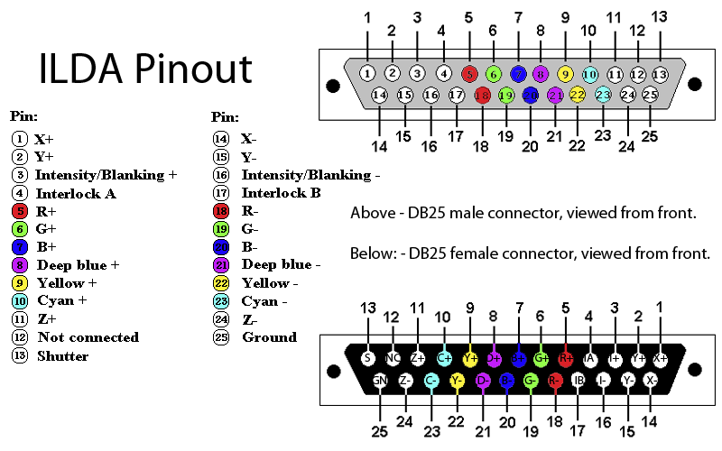

# 🔌 ILDA DB25 to RJ45 (Cat5/Cat6) Wiring & Pinout Guide

This document provides the hardware pinout mapping for connecting an **ILDA DB25 Standard Projector Port** to an **RJ45 (Cat5/Cat6 Ethernet Cable)** adapter (e.g. Pangolin ILDA-over-Cat5, EtherDream, Helios, or DIY RJ45 breakout boards).

### Official DB25 ILDA Pinout (Male & Female Views)


---

## 1. Standard ILDA DB25 Pinout Reference

| Pin # | Signal Name | Voltage Range | Description |
| :--- | :--- | :--- | :--- |
| **1** | **X+** | -5V to +5V | Galvo X Differential Positive |
| **14** | **X-** | +5V to -5V | Galvo X Differential Negative |
| **2** | **Y+** | -5V to +5V | Galvo Y Differential Positive |
| **15** | **Y-** | +5V to -5V | Galvo Y Differential Negative |
| **3** | **Intensity+** | 0V to +5V | Master Laser Intensity / Unblanking |
| **16** | **Intensity-** | 0V / GND | Intensity Differential Return |
| **4** | **Interlock A** | Loop to Pin 17 | Hardware Safety Shutter Loop |
| **17** | **Interlock B** | Loop to Pin 4 | Hardware Safety Shutter Loop |
| **5** | **Red+** | 0V to +5V | Red Laser Diode Modulation |
| **18** | **Red-** | 0V / GND | Red Differential Return |
| **6** | **Green+** | 0V to +5V | Green Laser Diode Modulation |
| **19** | **Green-** | 0V / GND | Green Differential Return |
| **7** | **Blue+** | 0V to +5V | Blue Laser Diode Modulation |
| **20** | **Blue-** | 0V / GND | Blue Differential Return |
| **25** | **GND** | 0V Reference | Common Signal Ground |

---

## 2. DB25 to RJ45 (Cat5e / Cat6) Standard T568B Adapter Mapping

Using twisted-pair network cable for ILDA reduces crosstalk and noise interference over long cable runs (up to 50 meters).

```
          DB25 Male Pinout                    RJ45 Plug (T568B Standard)
  +-------------------------------+         +----------------------------+
  | Pin  1: Galvo X+              | ------> | Pin 1: Orange-White        |
  | Pin 14: Galvo X-              | ------> | Pin 2: Orange              |
  | Pin  2: Galvo Y+              | ------> | Pin 3: Green-White         |
  | Pin 15: Galvo Y-              | ------> | Pin 6: Green               |
  | Pin  5: Red Laser (+5V)       | ------> | Pin 4: Blue                |
  | Pin  6: Green Laser (+5V)     | ------> | Pin 5: Blue-White          |
  | Pin  7: Blue Laser (+5V)      | ------> | Pin 7: Brown-White         |
  | Pin 25 & Interlock (GND/Loop) | ------> | Pin 8: Brown               |
  +-------------------------------+         +----------------------------+
```

---

## 2.1 Standard T568B Adapter Mapping

| RJ45 Pin | Wire Color (T568B) | DB25 Pin | Signal Function | Pair # |
| :--- | :--- | :--- | :--- | :--- |
| **Pin 1** | 🟧 White / Orange | **Pin 1** | Galvo X+ | Pair 2 (X Axis Differential) |
| **Pin 2** | 🟧 Solid Orange | **Pin 14** | Galvo X- | Pair 2 (X Axis Differential) |
| **Pin 3** | 🟩 White / Green | **Pin 2** | Galvo Y+ | Pair 3 (Y Axis Differential) |
| **Pin 4** | 🟦 Solid Blue | **Pin 5** | Red Laser Modulation (+5V) | Pair 1 (Colors) |
| **Pin 5** | 🟦 White / Blue | **Pin 6** | Green Laser Modulation (+5V) | Pair 1 (Colors) |
| **Pin 6** | 🟩 Solid Green | **Pin 15** | Galvo Y- | Pair 3 (Y Axis Differential) |
| **Pin 7** | 🟫 White / Brown | **Pin 7** | Blue Laser Modulation (+5V) | Pair 4 (Color & Ground) |
| **Pin 8** | 🟫 Solid Brown | **Pin 25 & 4-17** | Common GND & Shutter Interlock Loop | Pair 4 (Ground) |

---

## 2.2 Your Cable: Sequential Straight-Pair RJ45 Pinout

If your RJ45 plug has the exact wire sequence: **Orange-White, Orange, Blue-White, Blue, Green-White, Green, Brown-White, Brown** (pins 1 to 8 in order):

```
         DB25 Male Pinout                 Sequential RJ45 Plug (Your Cable)
  +-------------------------------+         +----------------------------+
  | Pin  1: Galvo X+              | ------> | Pin 1: Orange-White        |
  | Pin 14: Galvo X-              | ------> | Pin 2: Orange              |
  | Pin  2: Galvo Y+              | ------> | Pin 3: Blue-White          |
  | Pin 15: Galvo Y-              | ------> | Pin 4: Blue                |
  | Pin  5: Red Laser (+5V)       | ------> | Pin 5: Green-White         |
  | Pin  6: Green Laser (+5V)     | ------> | Pin 6: Green               |
  | Pin  7: Blue Laser (+5V)      | ------> | Pin 7: Brown-White         |
  | Pin 25 & Interlock (GND/Loop) | ------> | Pin 8: Brown               |
  +-------------------------------+         +----------------------------+
```

### Sequential Wire Mapping Table

| RJ45 Pin | Wire Color on Your Cable | DB25 Pin | Signal Function | Pair # |
| :--- | :--- | :--- | :--- | :--- |
| **Pin 1** | 🟧 White / Orange | **Pin 1** | Galvo X+ (Positive X Axis) | Pair 1 (Galvo X Differential) |
| **Pin 2** | 🟧 Solid Orange | **Pin 14** | Galvo X- (Negative X Axis) | Pair 1 (Galvo X Differential) |
| **Pin 3** | 🟦 White / Blue | **Pin 2** | Galvo Y+ (Positive Y Axis) | Pair 2 (Galvo Y Differential) |
| **Pin 4** | 🟦 Solid Blue | **Pin 15** | Galvo Y- (Negative Y Axis) | Pair 2 (Galvo Y Differential) |
| **Pin 5** | 🟩 White / Green | **Pin 5** | Red Laser Modulation (+5V) | Pair 3 (Laser Modulation) |
| **Pin 6** | 🟩 Solid Green | **Pin 6** | Green Laser Modulation (+5V) | Pair 3 (Laser Modulation) |
| **Pin 7** | 🟫 White / Brown | **Pin 7** | Blue Laser Modulation (+5V) | Pair 4 (Color & Ground) |
| **Pin 8** | 🟫 Solid Brown | **Pin 25 & 4-17** | Common GND & Shutter Interlock Loop | Pair 4 (Ground / Safety) |

---

## 3. Hardware Notes & Interlock Jumper

1. **Safety Interlock Loop**:
   * Pins **4** and **17** on the DB25 connector **must be shorted together** (or wired through an emergency E-Stop kill switch). If Pins 4 and 17 are disconnected, most ILDA projectors will activate their internal mechanical safety shutter and block all laser beams.
2. **Grounding**:
   * Ensure DB25 Pin 25 is tied to RJ45 Pin 8 and cable shielding to prevent ground loops and galvo jitter.
3. **Differential Signals**:
   * Keeping $(X+, X-)$ and $(Y+, Y-)$ on dedicated twisted pairs (Orange/White-Orange & Green/White-Green) ensures maximum noise immunity when driving high-speed galvo scanners up to 30,000 pps.
